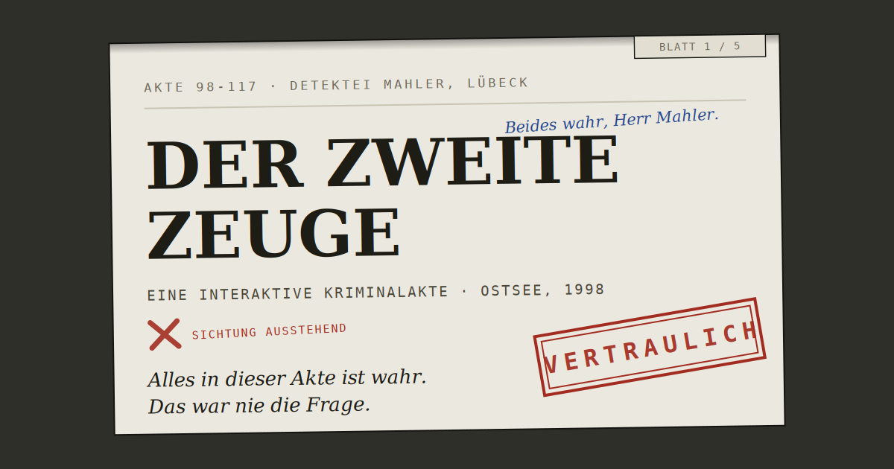

# Der zweite Zeuge

**Eine interaktive Kriminalakte · Ostsee, 1998**

> Diese Akte wurde am 24. Oktober 1998 geschlossen.
> Neunzehn Tage später war Martin Voss tot.
> Die Polizei hat die Akte gelesen. Die Versicherung hat die Akte gelesen. Niemand hat etwas gefunden.
> Jetzt lesen Sie.

Ein Lübecker Privatdetektiv dokumentiert eine Affäre. Alles in seiner Akte ist wahr — jedes Datum, jedes Kennzeichen, jedes Bild. Sie sichten die digitalisierte Akte, prüfen die Beweisstücke und bestätigen den Befund. Was danach kommt, hat mit Ihnen zu tun.

**Lesezeit:** 10–15 Minuten · **Am besten mit Kopfhörern** (die Tonaufnahme ist Teil der Ermittlung) · Mobil und am Desktop lesbar · Keine Installation, keine Anmeldung, keine Datenerfassung.

---

## Direkt lesen

**→ [Akte 98-117 öffnen](https://DEIN-NUTZERNAME.github.io/der-zweite-zeuge/)**

*(Link wird aktiv, sobald GitHub Pages eingerichtet ist — siehe unten.)*

---

## Selbst hosten (GitHub Pages)

1. Dieses Repository anlegen (z. B. `der-zweite-zeuge`) und drei Dateien hochladen:
   - `index.html` — die Akte (die Datei `der-zweite-zeuge.html` dafür in `index.html` umbenennen)
   - `cover.png` — das Titelbild
   - `README.md` — diese Datei
2. In den Repository-Einstellungen: **Settings → Pages → Source: Deploy from a branch → main / root** → Save.
3. Nach etwa einer Minute ist die Akte unter `https://DEIN-NUTZERNAME.github.io/der-zweite-zeuge/` erreichbar.
4. **Für die Link-Vorschau beim Teilen** (WhatsApp, Signal, LinkedIn etc.): In der `index.html` im `<head>` die zwei Stellen `https://DEIN-NUTZERNAME.github.io/der-zweite-zeuge/cover.png` durch die echte Adresse ersetzen. Danach zeigt jeder geteilte Link automatisch das Cover, den Titel und den Teaser-Text an.
5. Optional, für die Vorschau des Repos selbst: **Settings → General → Social preview** → `cover.png` hochladen.

## Technik

Eine einzige HTML-Datei, ohne Framework, ohne Backend. Schriften via Google Fonts, Tonaufnahme eingebettet. Es werden keine Daten erhoben, gespeichert oder übertragen; die Sichtungsvermerke existieren nur im Browser und verschwinden beim Schließen.

## Hinweis

Dies ist ein Werk der Fiktion. Alle Personen, Firmen und Ereignisse sind erfunden; Ähnlichkeiten mit realen Personen wären zufällig. Lübeck, Niendorf und der Oktober 1998 gehören sich selbst.

---

*Akte 99-041 ist noch nicht digitalisiert.*
